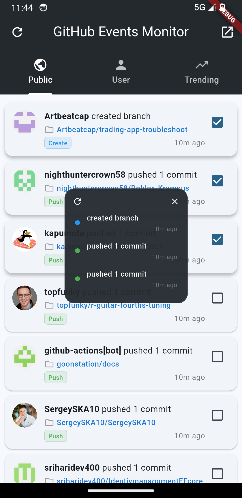
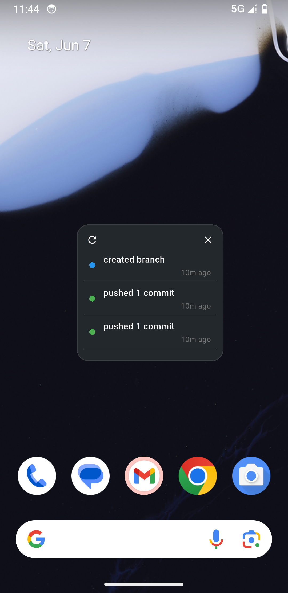

# Floating Window Android

A Flutter plugin for Android floating windows, providing an easy-to-use and feature-rich floating window solution.

[](https://pub.dev/packages/floating_window_android)
[](https://pub.dev/packages/floating_window_android)

## Screenshots

<p align="center">
  
  
</p>

_Left: Main app interface with GitHub events selection. Right: Floating window displaying selected events with draggable functionality._

## Features

- 💪 Display independent Flutter UI in a floating window, running separately from the main app
- 🔄 Support bidirectional communication and data sharing between floating window and main app
- 🎯 Customize floating window size, position, and alignment
- 👆 Support dragging with edge snapping effects
- 🚥 Multiple interaction modes (click-through, default mode, focus pointer mode)
- 🛎️ Fully customizable notification style and visibility
- 🔄 Dynamically adjust floating window properties at runtime
- ⚡ Performance optimization with preloaded Flutter engines for faster startup

## Installation

Add the dependency to your `pubspec.yaml` file:

```yaml
dependencies:
  floating_window_android: ^1.1.0
```

## Required Permissions

This plugin requires the `SYSTEM_ALERT_WINDOW` permission to display floating windows. On Android 6.0 (API 23) and above, users need to manually grant this permission. The plugin provides APIs for permission requests and checks.

Ensure you add the following permissions to your `AndroidManifest.xml` file:

```xml
<uses-permission android:name="android.permission.SYSTEM_ALERT_WINDOW" />
<uses-permission android:name="android.permission.FOREGROUND_SERVICE"/>
```

## Basic Usage

### Initialization and Permission Check

```dart
// Check if floating window permission is granted
bool granted = await FloatingWindowAndroid.isPermissionGranted();
if (!granted) {
  // Request permission
  await FloatingWindowAndroid.requestPermission();
}
```

### Display Floating Window

```dart
// Show floating window
await FloatingWindowAndroid.showOverlay(
  width: WindowSize.matchParent, // Or custom width (pixels)
  height: 300, // Custom height (pixels)
  alignment: OverlayAlignment.top, // Floating window alignment
  flag: OverlayFlag.defaultFlag, // Floating window interaction mode
  enableDrag: true, // Enable dragging
  positionGravity: PositionGravity.auto, // Snapping effect after dragging
  overlayTitle: "Floating Window Title", // Notification title
);
```

### Close Floating Window

```dart
// Close floating window from main app
await FloatingWindowAndroid.closeOverlay();

// Close floating window from within the floating window
await FloatingWindowAndroid.closeOverlayFromOverlay();
```

### Adjust Floating Window

```dart
// Change floating window size
await FloatingWindowAndroid.resizeOverlay(400, 600);

// Move floating window position
await FloatingWindowAndroid.moveOverlay(OverlayPosition(100, 200));

// Update floating window interaction mode
await FloatingWindowAndroid.updateFlag(OverlayFlag.clickThrough);
```

### Data Sharing

```dart
// Send data from main app to floating window
await FloatingWindowAndroid.shareData({
  'key': 'value',
  'count': 10,
});

// Receive data from main app in floating window
FloatingWindowAndroid.overlayListener.listen((event) {
  // Process received data
  print('Received data: $event');
});
```

### Open Main App from Floating Window

```dart
// Open main app from floating window
await FloatingWindowAndroid.openMainApp({
  'from': 'overlay',
  'action': 'view_details',
});
```

### Navigate to Specific Page from Floating Window

To implement navigation from floating window to a specific page in the main app, follow these steps:

1. First, call `openMainApp()` from the floating window with the parameters you want to pass:

```dart
// In floating window
await FloatingWindowAndroid.openMainApp({
  'page': 'details',
  'id': '123',
  'name': 'product_name',
});
```

2. Configure your MainActivity to handle the parameters and navigate accordingly:

```kotlin
// In MainActivity.kt
class MainActivity: FlutterActivity() {
    private val CHANNEL = "com.maojiu.your_app/navigation"
    private var methodChannel: MethodChannel? = null
    private var pendingParams: Map<String, Any?>? = null

    override fun configureFlutterEngine(flutterEngine: FlutterEngine) {
        super.configureFlutterEngine(flutterEngine)

        methodChannel = MethodChannel(flutterEngine.dartExecutor.binaryMessenger, CHANNEL)
    }

    override fun onNewIntent(intent: Intent) {
        super.onNewIntent(intent)
        setIntent(intent)
        handleIntent(intent)
    }

    private fun handleIntent(intent: Intent?) {
        val extras = intent?.extras
        if (extras != null) {
            val params = mutableMapOf<String, Any?>()

            for (key in extras.keySet()) {
                val value = extras.get(key)
                params[key] = value
            }

            if (params.isNotEmpty()) {
                // Send params to Flutter
                methodChannel?.invokeMethod("navigateToPage", params)
            }
        }
    }
}
```

3. Set up a method channel listener in your Flutter app to handle navigation:

```dart
// In main Flutter app
static const channel = MethodChannel('com.maojiu.your_app/navigation');

@override
void initState() {
  super.initState();
  channel.setMethodCallHandler(_handleMethodCall);
}

Future<dynamic> _handleMethodCall(MethodCall call) async {
  if (call.method == 'navigateToPage') {
    final params = call.arguments as Map;
    final page = params['page'];

    if (page == 'details') {
      // Navigate to details page with the provided parameters
      Navigator.push(
        context,
        MaterialPageRoute(
          builder: (context) => DetailsPage(
            id: params['id'],
            name: params['name'],
          ),
        ),
      );
    }
  }
}
```

This implementation allows seamless navigation from floating window to specific pages in your main app with parameter passing.

## Performance Optimization with Preloaded Engines

To achieve faster floating window startup times, this plugin supports preloading Flutter engines. This technique significantly reduces the time needed to display the floating window by preparing the Flutter runtime environment in advance.

### How Preloaded Engines Work

When you call `showOverlay()`, the plugin normally needs to:

1. Initialize a new Flutter engine
2. Load and parse the Dart code
3. Build the widget tree
4. Display the floating window

With preloaded engines, steps 1-2 are completed during app initialization, reducing the startup time from ~2-3 seconds to ~500ms.

### Implementation

**1. Preload the Engine During App Initialization:**

```dart
class _MyAppState extends State<MyApp> {
  @override
  void initState() {
    super.initState();

    // Preload Flutter engine during app startup
    WidgetsBinding.instance.addPostFrameCallback((_) async {
      await FloatingWindowAndroid.preloadFlutterEngine();
      print("Flutter engine preloaded successfully");
    });
  }

  @override
  void dispose() {
    // Clean up preloaded engine to free memory
    FloatingWindowAndroid.cleanupPreloadedEngine();
    super.dispose();
  }
}
```

**2. Check Engine Status (Optional):**

```dart
// Check if the engine is ready before showing overlay
bool isReady = await FloatingWindowAndroid.isFlutterEnginePreloaded();
if (isReady) {
  print("Engine is preloaded and ready for fast startup");
} else {
  print("Engine not preloaded, will use standard startup");
}
```

**3. Show Floating Window (Same API):**

```dart
// The showOverlay API remains the same
// But now it will start much faster if engine is preloaded
await FloatingWindowAndroid.showOverlay(
  width: 300,
  height: 400,
  alignment: OverlayAlignment.center,
  enableDrag: true,
);
```

### Memory Management

- **Preloading**: The preloaded engine consumes approximately 20-30MB of additional memory
- **Cleanup**: Always call `cleanupPreloadedEngine()` when your app is being destroyed
- **Smart Loading**: The engine is only preloaded once and reused for subsequent overlay displays

### Best Practices

1. **Preload Early**: Call `preloadFlutterEngine()` during app initialization for best results
2. **Handle Failures**: Preloading might fail on low-memory devices, but `showOverlay()` will still work with standard startup
3. **Clean Up**: Always clean up the preloaded engine in your app's dispose method
4. **Monitor Memory**: Be aware of the additional memory usage, especially on lower-end devices

### Performance Comparison

| Scenario              | Without Preloading | With Preloading |
| --------------------- | ------------------ | --------------- |
| First overlay display | ~2-3 seconds       | ~1 seconds      |
| Subsequent displays   | ~1-2 seconds       | ~800ms          |

## Floating Window Entry Point Configuration

The floating window requires a separate Dart entry point. Define it in your `main.dart` file:

```dart
import 'package:flutter/material.dart';

// Floating window entry point
@pragma("vm:entry-point")
void overlayMain() {
  runApp(
    const MaterialApp(
      debugShowCheckedModeBanner: false,
      home: YourOverlayWidget(),
    ),
  );
}

// Main app entry point
void main() {
  runApp(
    const MaterialApp(
      home: YourMainApp(),
    ),
  );
}
```

## Interaction Modes

The plugin supports three interaction modes, configured via `OverlayFlag`:

- `OverlayFlag.clickThrough`: Click-through mode, where the floating window never receives touch events
- `OverlayFlag.defaultFlag`: Default mode, where the floating window captures internal touch events but doesn't gain focus
- `OverlayFlag.focusPointer`: Focus pointer mode, allowing the floating window to gain input focus, suitable for floating windows containing input fields

## Position Control

The position behavior after dragging can be set through `PositionGravity`:

- `PositionGravity.none`: No special behavior, the floating window stays where the drag ends
- `PositionGravity.left`: Automatically snaps to the left side of the screen
- `PositionGravity.right`: Automatically snaps to the right side of the screen
- `PositionGravity.auto`: Automatically snaps to the nearest screen edge based on the drag end position

## Notes

- This plugin only supports the Android platform
- Android 8.0 (API 26) and above require a foreground service notification
- Some Android systems may have restrictions or require special permissions for floating windows
- Ensure you handle permission requests and checks correctly
- Floating window features consume system resources, close them when not in use

## API Reference

See the code documentation for a complete API reference.

## License

```
MIT License
```

# floating_window_android
